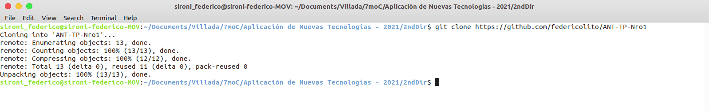
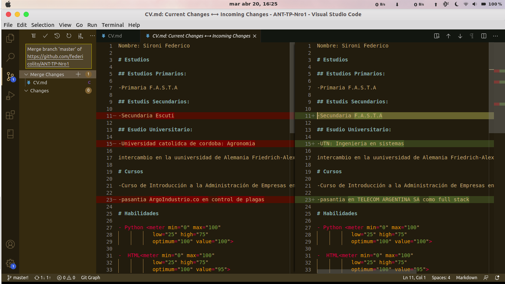
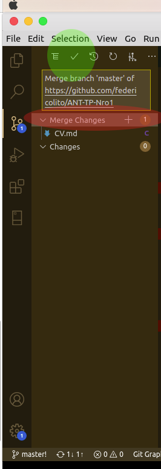

# Trabajo Practico Nro1

Repositorio de github utilizado en este trabajo [repo](https://github.com/federicolito/ANT-TP-Nro1)

## 2- Crear un repositorio local y agregar archivos
- iniciar un repositorio local como se muestra en la imagen.
- Creamos los dos archivos Readme y el cv como se muestra en las imagenes.
- Creamos un commit de los nuevos archivos y con el "-a" los stageamos automaticamente.

## 3- Crear un repositorio remoto
- Creamos una cuenta [github](https://github.com) y alli creamos un nuevo repositorio como el de la imagen.

- Asociamos el repositoria creado en github con el local creado en el punto anterior con el comando 'git remote'.

- Y pusheamos a el repositorio remoto ingresando nuestras credenciales y como en la imagen.

## 4- Familiarizarse con el concepto de Pull Request
- primero para ver el ejemplo de pull request creamos una rama nueva y agreagamos cambios al cv por ejemplo.

- Luego desde la pagina de [github](https://github.com) en la seccion de pull Requests iniciamos uno nuevo en donde seleccionamos la base ,la rama master,y con cual se comparara en nuestro caso la nueva rama creada "Branch2".

- Luego ponemos un titulo y una descripcion que puede ser mucho mas detallada si queremos.

- despues seguimos con los siguientes pasos como en la foto y mergeamos el pull request.

## 5- Mergear código con conflictos
- instale la herramienta Visual Studio Code desde su pagina [vscode](https://code.visualstudio.com/)
- Luego clone el repositorio de github en un nuevo directorio.

- Despues en el primer directorio del primer clon del repositorio hice algunos cambios en el curriculum vitae hice commit e hice push al remoto.

- En el clon del segundo segundo repositorio hice algunos cambio en las mismas lineas que el punto anterior, hice commit.

- Como se ve en el ovalo rojo de la sigueiente imagen la herramienta de vscode nos indica que tenemos un pull para hacer pero tambien un push.

- Si intentamos apretar hacer ese pull y push apretando en lo mencionado anteriormente nos aparecera una ventana como la siguiente que nos dira cuales son los cambios que hay localmente y los remotos. Con esta herramienta nosotros podremos cambia el modo de visualizacion y despues elegir cual cambios nos quedaremos y cuales importaremos o si queremos los dos cambios.

En la sig. imagen observamos un cambio de apariencia en cuanto a como se ven los cambios remotos y locales.

- Como ultimo paso una vez resolvimos los conflictos y viendo la siguiente imagen vemos que apretando el "+" agregaremos los cambios que queremos mergear y hacemos un commit apretando el tick en verde, y por ultimo en la parte de abajo como se ve en la imagen dos de este punto veremos que estamos a dos push de el remoto al hacer click habremos finalizado el tp Nro1.

img 1

img 2

